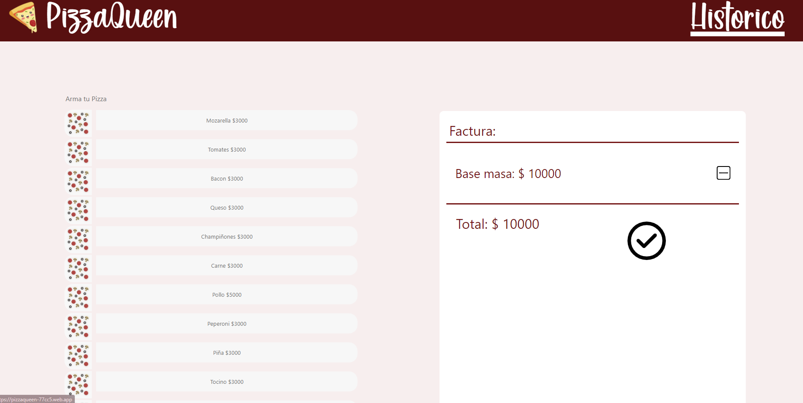

# PizzaQueen

​

## Índice

​

- [PizzaQueen](#pizza-queen)
  - [Instalación](#instalacion)
  - [Índice](#índice)
  - [1. Preámbulo](#1-preámbulo)
  - [2. Resumen del desarrollo del proyecto](#2-resumen-del-desarrollo-del-proyecto)
  - [3. Carpetas que encontrarás en el repositorio](#3-carpetas-que-encontrarás-en-el-repositorio)
  - [SRC](#src)
    - [Components](#components)
    - [Pages](#Pages)
    - [README](#readme)
  - [4. Look final del proyecto vista de ordenador](#4-look-final-del-proyecto-vista-de-ordenador)
  - [5. Look final del proyecto vista de móvil](#5-look-final-del-proyecto-vista-de-móvil)

​

# Instalación

## Instalar dependencias

```bash
npm install
```

## 1. Preámbulo

​
Este proyecto se realizo para una prueba técnica, se propuso una pagina de pedidos para pizzas, el objetivo principal de este proyecto es que el usuario creara su pizza de pendiendo de los ingredientes, que el clientes pudiera ver el historico de pedidos.
​
## 2. Resumen del desarrollo del proyecto
​
Se realizo una app para pedidos de pizzas, para la app se utilizo como tecnología ReactJS, para la base de datos Firebase, se enfoca en la creación de pizzas desde cero agregando los ingredientes, un historico donde se muestran las pizzas creadas y datos de estas.


## 3. Carpetas que encontrarás en el repositorio

## SRC

### Components

| Archivo       | Descripción                    |
| :------------ | :----------------------------- |
| app,js       | Cuerpo de la página            |
| index.js     | router de la aplicación           |
| items.js | data de los ingredientes|
| firebaseguardarpedido.js | funcionalidad de guardar la pizza en firebase    |


### Pages

| Archivo   | Descripción                   |
| :-------- | :---------------------------- |
| home.js | Página principal del proyecto |
| cocina.js | Página donde se realiza el pedido |

### Components

| Archivo   | Descripción                   |
| :-------- | :---------------------------- |
| dashboard.js | Historico de pedidos|
| nombreComponente.js | componentes de la aplicación |
​

​

### README

​
| Archivo | Descripción |
| :-------- | :---------------------------- |
| readme.md | Información general del proyecto|
​
​

## 4. Look final del proyecto vista de ordenador

​

​



​

## 5. Look final del proyecto vista de móvil


